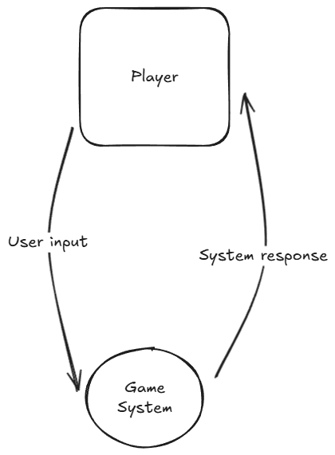

# Software Engineering Task 2
### By Riley Dowse
# Sprint 1


## Task Definition


TBC


## Requirements definition
### Functional requirements
- Users must be able to view a bot in a fun and interactive GUI and play Joker's Judgement.
- The system must have random drawing and deck splitting
- The system must be able to track players' health and card inventories.
- The system must follow the rules of Joker's judgement
- The system must clearly show who is the winner and loser.


### Non Functional requirements
- The system must respond quickly to the players actions
- It must load within 3 seconds
- The game must maintain smooth and responsive
- The controls must be simple yet functional and easy to pick up
- Have settings to adapt and modify the user's experience
- The system must be reliable and not crash
- The game should handle errors gracefully and provide clear error messages.
- The game must have clear documentation and install steps.
- The game's rules must be clear and understandable.


## Determining Specifications
### Functional Specifications
What does the system actually NEED to do?


User Requirements
- Users must be able to view a bot in a fun and interactive GUI and play Joker's Judgement.
- The user needs to be able to input their actions and receive an output by the system informing them of their actions.


Inputs & Outputs
- The system needs to have clear and responsive inputs that correctly match the user's intent.
- The system needs to have simple but clear outputs that clearly display the game state to the user
- The input system has to be logical and easy to understand and pickup


Core Features
- At its core it needs to provide a fun card game experience that follows the rules of Joker's judgement
- It needs to be an exciting card game played against a challenging but fun bot.
- The system needs to be enticing to a wide variety of players.


User Interaction
- The users will interact with the game in a logical but simple GUI. A detailed readme will explain how to use the program, furthermore the rules of the game will be clearly laid out in a separate readme.
- The user
Error Handling
- The game will print errors in the terminal and provide game information for debugging purposes.
- I will also list errors with the program in the readme and provide clear and achievable solutions to them
What possible errors could you face that need to be handled by the system?
### Non Functional Specifications


Performance
- The system needs to respond quickly to the users input and be fluid and smooth at all times
- The system must remain at a consistent 60fps
- The system must load all aspects in less than 3 seconds
How quickly should we try to get the system to perform tasks, what efficiency is required to maintain user engagement? How can we ensure our program remains efficient?


Useability / Accessibility
- My readme and installation guide will make it easy for anyone to install my game and cater to a wide variety of technological knowledge levels.
- If I have time I will code more accessibility settings.
How might you make your application more accessible? What could you do with the User Interface to improve usability?


Reliability
- I will code clear error messages and address all
- The user's data does not disclose any personal information and will be kept from the AI bot to keep the game fair and equal.


## Use case diagram
Actor: User


Preconditions: A suitable operating system that can run .exe files or alternatively an IDE that can run python files.


Main Flow:
- Begin - User selects the option to play.


- Setup – The system equally splits a deck of cards that have


- Draw Card – User clicks the draw pile


- Play Card- User selects a number card or an ability card to play


- Attack - User attacks with a number card leading the system to defend


Postconditions: Turn changes to the system , the user draws a card and play's a card.


## Design
Storyboard
  
Data Frame Diagram Level 0


  
Data Frame Diagram Level 1

### Gantt Chart

## Build and Test
```python
import pygame
# Intergration to be added 
#import game_logic as g
#from game_logic import *
from pygame import *
import time as t
# Imports 

# Set up pygame
pygame.init()
programIcon = pygame.image.load('images/Icon.png') # Load the Icon
pygame.display.set_icon(programIcon) # Set Icon
pygame.display.set_caption("Joker's Judgement") # Set window title
screen = pygame.display.set_mode((0,0),pygame.FULLSCREEN)
#screen = pygame.display.set_mode((450,450))

# Establish screen size, font sizing and pygame clock
w, h = pygame.display.get_surface().get_size()
title_font = pygame.font.SysFont("segoeprint", 80)
font = pygame.font.SysFont("segoeprint", 30)
clock = pygame.time.Clock()
windeath_font = pygame.font.SysFont("segoeprint", 150)
clock.tick(60)

health_player = 20
health_enemy = 20

def menu_draw():
	""" Draws the menu screen for the game. 
	The function is simply a cleaner way to call it when required as compared to dumping the text block inside the core loop.
	"""

	screen.fill((47, 158, 68)) # The green colour used in the program.
	width = 750
	height = 100
	global play_button # I know globals are bad practice and lazy 
	global quit_button #but its simply the first prototype.
	global options_button
	play_button = pygame.draw.rect(screen, (255, 255, 255), ((w-width)//2, 600, width, height))
	options_button = pygame.draw.rect(screen, (255, 255, 255), ((w-width)//2, 750, width, height))
	quit_button = pygame.draw.rect(screen, (255, 255, 255), ((w-width)//2, 900, width, height))
	title = title_font.render("Joker's Judgement", 1, (255,255,255))
	play = font.render("Play", 1, (0,0,0))
	quit = font.render("Quit", 1, (0,0,0))
	options = font.render("Options", 1, (0,0,0))
	text_rect = title.get_rect(center=(w//2,150))
	play_text = play.get_rect(center=play_button.center)
	options_text = options.get_rect(center=options_button.center)
	quit_text = quit.get_rect(center=quit_button.center)
	screen.blit(title, text_rect)
	screen.blit(play, play_text)
	screen.blit(options, options_text)
	screen.blit(quit, quit_text)

def main():
	""" The main game function. 
	The function is used to cleanly call the loop, as I said above. I will likely call other functions or change other things to a class in later sprints.
	"""
	screen.fill((47, 158, 68))
	Height = 125
	Width = 100
	player_draw_pile = pygame.draw.rect(screen, (25,113,194), (20, 700, Width, Height))
	bot_draw_pile = pygame.draw.rect(screen, (224,49,49), (1820, 300, Width, Height))
	card1 = pygame.draw.rect(screen, (255,255,255), (800+0*(110),930 , Width, Height))
	card2 =  pygame.draw.rect(screen, (255,255,255), (800+1*(110),930 , Width, Height))
	card3 =  pygame.draw.rect(screen, (255,255,255), (800+2*(110),930 , Width, Height))
	card1_bot = pygame.draw.rect(screen, (224,49,49), (800+0*(110),50 , Width, Height))
	card2_bot =  pygame.draw.rect(screen, (224,49,49), (800+1*(110),50 , Width, Height))
	card3_bot =  pygame.draw.rect(screen, (224,49,49), (800+2*(110),50 , Width, Height))
	played_card_bot =  pygame.draw.rect(screen, (224,49,49), (800+1*(110),300 , Width, Height))
	# Importantly the bots knowledge doesn't exist yet and won't until the game is devolped further in later sprints.
	played_card =  pygame.draw.rect(screen, (255,255,255), (800+1*(110),700 , Width, Height))
	players_health = title_font.render(str(health_player), 1, (25,113,194))
	text_rect_player = players_health.get_rect(center=(100,980))
	screen.blit(players_health, text_rect_player)
	enemy_health = title_font.render(str(health_enemy), 1, (224,49,49))
	text_rect_enemy = enemy_health.get_rect(center=(1820,100))
	screen.blit(enemy_health, text_rect_enemy)
	pygame.display.flip()
	pos = pygame.mouse.get_pos()
	pressed = pygame.mouse.get_pressed()[0]
	# Leftover debugging, leaving as will need in further dev sprints
	#print(pos)
	# Collisoin dectetion 
	if player_draw_pile.collidepoint(pos) and pressed:
		screen.fill((47, 158, 68))
		filler = title_font.render("Draw Logic goes here", 1, (255,255,255))
		text_rect_2 = filler.get_rect(center=(w//2,150))
		screen.blit(filler, text_rect_2)
		pygame.display.flip()
		t.sleep(2)
	elif card1.collidepoint(pos) and pressed:
		screen.fill((47, 158, 68))
		filler = title_font.render("Card Play Logic goes here", 1, (255,255,255))
		text_rect_2 = filler.get_rect(center=(w//2,150))
		screen.blit(filler, text_rect_2)
		pygame.display.flip()
		t.sleep(2)
	elif card2.collidepoint(pos) and pressed:
		screen.fill((47, 158, 68))
		filler = title_font.render("Card Play Logic goes here", 1, (255,255,255))
		text_rect_2 = filler.get_rect(center=(w//2,150))
		screen.blit(filler, text_rect_2)
		pygame.display.flip()
		t.sleep(2)
	elif card3.collidepoint(pos) and pressed:
		screen.fill((47, 158, 68))
		filler = title_font.render("Card Play Logic goes here", 1, (255,255,255))
		text_rect_2 = filler.get_rect(center=(w//2,150))
		screen.blit(filler, text_rect_2)
		pygame.display.flip()
		t.sleep(2)
	elif played_card.collidepoint(pos) and pressed:
		screen.fill((47, 158, 68))
		filler = title_font.render("Attack Logic goes here", 1, (255,255,255))
		text_rect_2 = filler.get_rect(center=(w//2,150))
		screen.blit(filler, text_rect_2)
		pygame.display.flip()
		t.sleep(2)
	elif pygame.key.get_pressed()[pygame.K_w]:
		screen.fill((255,255,255))
		win_text = windeath_font.render("You win!", True, (0,0,0))
		text_rect_idk = win_text.get_rect(center=(w//2,h//2))
		screen.blit(win_text, text_rect_idk)
		pygame.display.flip()
		t.sleep(2)
	elif pygame.key.get_pressed()[pygame.K_l]:
		screen.fill((0,0,0))
		win_text = windeath_font.render("You Lose!", True, (255,0,0))
		text_rect_idk = win_text.get_rect(center=(w//2,h//2))
		screen.blit(win_text, text_rect_idk)
		pygame.display.flip()
		t.sleep(2)
def options():
	# See above explanmations, to be fleshed out later on to provide the user with a better experience.
	screen.fill((47, 158, 68))
	filler = title_font.render("Options Coming Soon", 1, (255,255,255))
	text_rect_2 = filler.get_rect(center=(w//2,150))
	screen.blit(filler, text_rect_2)
	pygame.display.flip()

# Main game loop that calls the diffrent functions to navigate through.
game_state = "menu"
running = True
while running:
	for event in pygame.event.get():
		if event.type == pygame.QUIT:
			running = False
		elif pygame.key.get_pressed()[pygame.K_ESCAPE]:
			game_state = "menu"
	pygame.display.flip()
	if game_state == "menu": 
		menu_draw()
		pygame.display.flip()
		pos = pygame.mouse.get_pos()
		pressed = pygame.mouse.get_pressed()[0]
		if play_button.collidepoint(pos) and pressed:
			game_state = "playing"
		elif options_button.collidepoint(pos) and pressed:
			game_state = "options"
		elif quit_button.collidepoint(pos) and pressed:
			running = False
		pygame.display.flip()
	elif game_state == "playing":
		main()
	elif game_state == "options":
		options()
	else:
		# Error handling but should never happen
		print("How did you escape the matrix?")
		running = False
pygame.quit()

```


## Review
End of Sprint Review Questions
1. Evaluate how effectively your project meets the functional and non-functional requirements defined in your planning.


My pygame project in sprint 1 does not effectively meet the majority of the functional requirements and meets only a few of non functional requirements in the planning stage of my project. I don't effectively meet the requirements I set out as my program is only a non functional Graphical User Interface that is a template for further development in sprint 2. The user is unable to play the game or versus a bot. You are unable to follow rules or see your card hand. Positively by pressing W and L you can get the win and lose screens and the GUI is intuitive and easy to navigate around in.


2. Analyse the performance of your program against the key use-cases you identified.


It does not follow most of the key use cases however my program behaves as I expected it to in this first sprint of the project, it handles input and output well and hits most of the functional specifications focused around output and input. The program reacts smoothly and fast to inputs and outputs clear GUI screens that match my storyboard at a consistent frame rate. I will be able to hit more of the key use case's requirements as I continue the project in the next sprints.


3. Assess the quality of your code in terms of readability, structure, and maintainability.


My quality of code is average, the system uses functions for better readability and the code is explained with comments that makes the code quite readable. The structure of the program could be improved by using Object Oriented Programming (OOP) and applying classes to simplify my code. The maintainability is quite simple at the moment as I did extensive testing and the main problem is that we are unable to use any of the game logic so you can only navigate around a shell as such.


4. Explain the improvements that should be made in the next stage of development.


The next stage of development must hit most if not all of the functional criteria and ideally hit most of the non-functional criteria as well. I need to begin to incorporate OOP fundamentals into my program and remove some of the bad practice  to ensure my code's readability, quality and structure. By implementing OOP I can ensure that my game logic remains fast and speedy as I continue development, furthermore by removing my I can follow best coding practices to ensure that my code is easier to maintain and build upon. For example I need to remove the Global variables used to identify the button positions for collision handling to be able to navigate around the GUI.


# KEYNOTE! THE PROGRAM DOES NOT CURRENTLY WORK IN RESOLUTIONS THAT ARE NOT 1080P (1920 PIXELS WIDE BY 1080 PIXELS TALL)


## Credit


The Icon inspiration comes from https://drawsgood.itch.io/8bit-deck-card-assets.
I made my own much smaller version that was heavily influenced by the asset.
