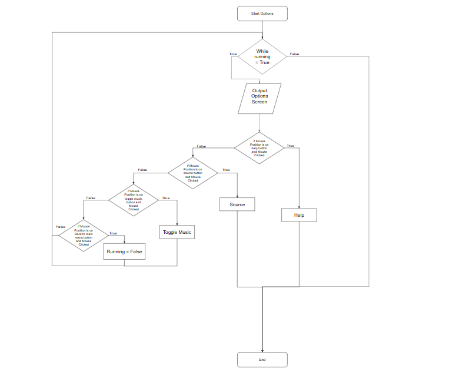

# Software Engineering Task 2
### By Riley Dowse
# Sprint 1

## Requirements definition
### Functional requirements
- Users must be able to view a bot in a fun and interactive GUI and play Joker's Judgement.
- The system must have random drawing and deck splitting
- The system must be able to track players' health and card inventories.
- The system must follow the rules of Joker's judgement
- The system must clearly show who is the winner and loser.

### Non Functional requirements
- The system must respond quickly to the players actions
- It must load within 3 seconds
- The game must maintain smooth and responsive
- The controls must be simple yet functional and easy to pick up
- Have settings to adapt and modify the user's experience
- The system must be reliable and not crash
- The game should handle errors gracefully and provide clear error messages.
- The game must have clear documentation and install steps.
- The game's rules must be clear and understandable.


## Determining Specifications
### Functional Specifications

User Requirements
- Users must be able to view a bot in a fun and interactive GUI and play Joker's Judgement.
- The user needs to be able to input their actions and receive an output by the system informing them of their actions.


Inputs & Outputs
- The system needs to have clear and responsive inputs that correctly match the user's intent.
- The system needs to have simple but clear outputs that clearly display the game state to the user
- The input system has to be logical and easy to understand and pickup


Core Features
- At its core it needs to provide a fun card game experience that follows the rules of Joker's judgement
- It needs to be an exciting card game played against a challenging but fun bot.
- The system needs to be enticing to a wide variety of players.


User Interaction
- The users will interact with the game in a logical but simple GUI. A detailed readme will explain how to use the program, furthermore the rules of the game will be clearly laid out in a separate readme.

Error Handling
- The game will print errors in the terminal and provide game information for debugging purposes.
- I will also list errors with the program in the readme and provide clear and achievable solutions to them
### Non Functional Specifications
Performance
- The system needs to respond quickly to the users input and be fluid and smooth at all times
- The system must remain at a consistent 60fps
- The system must load all aspects in less than 3 seconds
Useability / Accessibility
- My readme and installation guide will make it easy for anyone to install my game and cater to a wide variety of technological knowledge levels.
- Allow users to turn off and on any accesibility settings.

Reliability
- I will code clear error messages and address all problems in the read me.
- The user's data does not disclose any personal information and will be kept from the AI bot to keep the game fair and equal.


## Use case diagram
Actor: User


Preconditions: A suitable operating system that can run .exe files or alternatively an IDE that can run python files.


Main Flow:
- Begin - User selects the option to play.
- Setup – The system equally splits a deck of cards that have
- Draw Card – User clicks the draw pile
- Play Card- User selects a number card or an ability card to play
- Attack - User attacks with a number card leading the system to defend

Postconditions: Turn changes to the system , the user draws a card and play's a card.

### Use Case Diagram
  
## Design
### Storyboard
  
### Data Frame Diagram Level 0
  
### Data Frame Diagram Level 1

### Gantt Chart

## Build and Test
```python
import pygame
# Intergration to be added 
#import game_logic as g
#from game_logic import *
from pygame import *
import time as t
# Imports 

# Set up pygame
pygame.init()
programIcon = pygame.image.load('images/Icon.png') # Load the Icon
pygame.display.set_icon(programIcon) # Set Icon
pygame.display.set_caption("Joker's Judgement") # Set window title
screen = pygame.display.set_mode((0,0),pygame.FULLSCREEN)
#screen = pygame.display.set_mode((450,450))

# Establish screen size, font sizing and pygame clock
w, h = pygame.display.get_surface().get_size()
title_font = pygame.font.SysFont("segoeprint", 80)
font = pygame.font.SysFont("segoeprint", 30)
clock = pygame.time.Clock()
windeath_font = pygame.font.SysFont("segoeprint", 150)
clock.tick(60)

health_player = 20
health_enemy = 20

def menu_draw():
	""" Draws the menu screen for the game. 
	The function is simply a cleaner way to call it when required as compared to dumping the text block inside the core loop.
	"""

	screen.fill((47, 158, 68)) # The green colour used in the program.
	width = 750
	height = 100
	global play_button # I know globals are bad practice and lazy 
	global quit_button #but its simply the first prototype.
	global options_button
	play_button = pygame.draw.rect(screen, (255, 255, 255), ((w-width)//2, 600, width, height))
	options_button = pygame.draw.rect(screen, (255, 255, 255), ((w-width)//2, 750, width, height))
	quit_button = pygame.draw.rect(screen, (255, 255, 255), ((w-width)//2, 900, width, height))
	title = title_font.render("Joker's Judgement", 1, (255,255,255))
	play = font.render("Play", 1, (0,0,0))
	quit = font.render("Quit", 1, (0,0,0))
	options = font.render("Options", 1, (0,0,0))
	text_rect = title.get_rect(center=(w//2,150))
	play_text = play.get_rect(center=play_button.center)
	options_text = options.get_rect(center=options_button.center)
	quit_text = quit.get_rect(center=quit_button.center)
	screen.blit(title, text_rect)
	screen.blit(play, play_text)
	screen.blit(options, options_text)
	screen.blit(quit, quit_text)

def main():
	""" The main game function. 
	The function is used to cleanly call the loop, as I said above. I will likely call other functions or change other things to a class in later sprints.
	"""
	screen.fill((47, 158, 68))
	Height = 125
	Width = 100
	player_draw_pile = pygame.draw.rect(screen, (25,113,194), (20, 700, Width, Height))
	bot_draw_pile = pygame.draw.rect(screen, (224,49,49), (1820, 300, Width, Height))
	card1 = pygame.draw.rect(screen, (255,255,255), (800+0*(110),930 , Width, Height))
	card2 =  pygame.draw.rect(screen, (255,255,255), (800+1*(110),930 , Width, Height))
	card3 =  pygame.draw.rect(screen, (255,255,255), (800+2*(110),930 , Width, Height))
	card1_bot = pygame.draw.rect(screen, (224,49,49), (800+0*(110),50 , Width, Height))
	card2_bot =  pygame.draw.rect(screen, (224,49,49), (800+1*(110),50 , Width, Height))
	card3_bot =  pygame.draw.rect(screen, (224,49,49), (800+2*(110),50 , Width, Height))
	played_card_bot =  pygame.draw.rect(screen, (224,49,49), (800+1*(110),300 , Width, Height))
	# Importantly the bots knowledge doesn't exist yet and won't until the game is devolped further in later sprints.
	played_card =  pygame.draw.rect(screen, (255,255,255), (800+1*(110),700 , Width, Height))
	players_health = title_font.render(str(health_player), 1, (25,113,194))
	text_rect_player = players_health.get_rect(center=(100,980))
	screen.blit(players_health, text_rect_player)
	enemy_health = title_font.render(str(health_enemy), 1, (224,49,49))
	text_rect_enemy = enemy_health.get_rect(center=(1820,100))
	screen.blit(enemy_health, text_rect_enemy)
	pygame.display.flip()
	pos = pygame.mouse.get_pos()
	pressed = pygame.mouse.get_pressed()[0]
	# Leftover debugging, leaving as will need in further dev sprints
	#print(pos)
	# Collisoin dectetion 
	if player_draw_pile.collidepoint(pos) and pressed:
		screen.fill((47, 158, 68))
		filler = title_font.render("Draw Logic goes here", 1, (255,255,255))
		text_rect_2 = filler.get_rect(center=(w//2,150))
		screen.blit(filler, text_rect_2)
		pygame.display.flip()
		t.sleep(2)
	elif card1.collidepoint(pos) and pressed:
		screen.fill((47, 158, 68))
		filler = title_font.render("Card Play Logic goes here", 1, (255,255,255))
		text_rect_2 = filler.get_rect(center=(w//2,150))
		screen.blit(filler, text_rect_2)
		pygame.display.flip()
		t.sleep(2)
	elif card2.collidepoint(pos) and pressed:
		screen.fill((47, 158, 68))
		filler = title_font.render("Card Play Logic goes here", 1, (255,255,255))
		text_rect_2 = filler.get_rect(center=(w//2,150))
		screen.blit(filler, text_rect_2)
		pygame.display.flip()
		t.sleep(2)
	elif card3.collidepoint(pos) and pressed:
		screen.fill((47, 158, 68))
		filler = title_font.render("Card Play Logic goes here", 1, (255,255,255))
		text_rect_2 = filler.get_rect(center=(w//2,150))
		screen.blit(filler, text_rect_2)
		pygame.display.flip()
		t.sleep(2)
	elif played_card.collidepoint(pos) and pressed:
		screen.fill((47, 158, 68))
		filler = title_font.render("Attack Logic goes here", 1, (255,255,255))
		text_rect_2 = filler.get_rect(center=(w//2,150))
		screen.blit(filler, text_rect_2)
		pygame.display.flip()
		t.sleep(2)
	elif pygame.key.get_pressed()[pygame.K_w]:
		screen.fill((255,255,255))
		win_text = windeath_font.render("You win!", True, (0,0,0))
		text_rect_idk = win_text.get_rect(center=(w//2,h//2))
		screen.blit(win_text, text_rect_idk)
		pygame.display.flip()
		t.sleep(2)
	elif pygame.key.get_pressed()[pygame.K_l]:
		screen.fill((0,0,0))
		win_text = windeath_font.render("You Lose!", True, (255,0,0))
		text_rect_idk = win_text.get_rect(center=(w//2,h//2))
		screen.blit(win_text, text_rect_idk)
		pygame.display.flip()
		t.sleep(2)
def options():
	# See above explanmations, to be fleshed out later on to provide the user with a better experience.
	screen.fill((47, 158, 68))
	filler = title_font.render("Options Coming Soon", 1, (255,255,255))
	text_rect_2 = filler.get_rect(center=(w//2,150))
	screen.blit(filler, text_rect_2)
	pygame.display.flip()

# Main game loop that calls the diffrent functions to navigate through.
game_state = "menu"
running = True
while running:
	for event in pygame.event.get():
		if event.type == pygame.QUIT:
			running = False
		elif pygame.key.get_pressed()[pygame.K_ESCAPE]:
			game_state = "menu"
	pygame.display.flip()
	if game_state == "menu": 
		menu_draw()
		pygame.display.flip()
		pos = pygame.mouse.get_pos()
		pressed = pygame.mouse.get_pressed()[0]
		if play_button.collidepoint(pos) and pressed:
			game_state = "playing"
		elif options_button.collidepoint(pos) and pressed:
			game_state = "options"
		elif quit_button.collidepoint(pos) and pressed:
			running = False
		pygame.display.flip()
	elif game_state == "playing":
		main()
	elif game_state == "options":
		options()
	else:
		# Error handling but should never happen
		print("How did you escape the matrix?")
		running = False
pygame.quit()

```


## Review
### End of Sprint Review Questions
### 1. Evaluate how effectively your project meets the functional and non-functional requirements defined in your planning.

My pygame project in sprint 1 does not effectively meet the majority of the functional requirements and meets only a few of non functional requirements in the planning stage of my project. I don't effectively meet the requirements I set out as my program is only a non functional Graphical User Interface that is a template for further development in sprint 2. The user is unable to play the game or versus a bot. You are unable to follow rules or see your card hand. Positively by pressing W and L you can get the win and lose screens and the GUI is intuitive and easy to navigate around in.


### 2. Analyse the performance of your program against the key use-cases you identified.


It does not follow most of the key use cases however my program behaves as I expected it to in this first sprint of the project, it handles input and output well and hits most of the functional specifications focused around output and input. The program reacts smoothly and fast to inputs and outputs clear GUI screens that match my storyboard at a consistent frame rate. I will be able to hit more of the key use case's requirements as I continue the project in the next sprints.


### 3. Assess the quality of your code in terms of readability, structure, and maintainability.

My quality of code is average, the system uses functions for better readability and the code is explained with comments that makes the code quite readable. The structure of the program could be improved by using Object Oriented Programming (OOP) and applying classes to simplify my code. The maintainability is quite simple at the moment as I did extensive testing and the main problem is that we are unable to use any of the game logic so you can only navigate around a shell as such.

### 4. Explain the improvements that should be made in the next stage of development.

The next stage of development must hit most if not all of the functional criteria and ideally hit most of the non-functional criteria as well. I need to begin to incorporate OOP fundamentals into my program and remove some of the bad practice  to ensure my code's readability, quality and structure. By implementing OOP I can ensure that my game logic remains fast and speedy as I continue development, furthermore by removing my I can follow best coding practices to ensure that my code is easier to maintain and build upon. For example I need to remove the Global variables used to identify the button positions for collision handling to be able to navigate around the GUI.

# KEYNOTE! THE PROGRAM DOES NOT CURRENTLY WORK IN RESOLUTIONS THAT ARE NOT 1080P (1920 PIXELS WIDE BY 1080 PIXELS TALL)

# Sprint 2

## Design

### Structure Chart
  

## Algorithms
### Main Routine
### Flowchart
  

### Psudeocode
```
BEGIN Joker's Judement
    WHILE Program is running
        IF Game State = Menu
			Menu()
			IF MOS_Pos = Quit Button and Clicked 
				Running = False
			ELIF MOS_Pos = Play Button and Clicked 
			 	Game State = Playing
			ELIF MOS_Pos = Options Button and Clicked 
				Game State = Options
			ENDIF
        ELIF Game State = Options
            Options()
		ELIF Game State = Playing
			Game()
		ELSE
			Error Handling
        ENDIF
    ENDWHILE
END Joker's Judement 
```
### Game loop Subroutinue

### Flowchart
 

### Psudeocode
```
Begin Gameloop
Create Bot and User classes
Output green screen
Draw 3 cards
WHILE User Health and Bot Health > 0
	Draw 1 Card
	Update Health and Hands()
	User Input()
	Play()
	Update Health and Hands()
IF User Health > 0
	Win()
ELSE
	Lose()
ENDIF
```

### Options Subroutine

### Flowchart
  

### Psudeocode
```
Begin Options
WHILE Program is running
		OUTPUT OPTION SCREEN
		IF MOS_Pos = Help Button and Clicked 
			Help
		ELIF MOS_Pos = Play Button and Clicked 
			Source
		ELIF MOS_Pos = Toggle Music Button and Clicked 
			Toggle Music
		ELIF MOS_Pos = Main Menu Button and Clicked 
			Running = False
		ENDIF
    ENDWHILE
END Options
```

## Build and Test
#### Main
```py
import pygame
from game_logic import *
# Imports 

# Set up pygame
pygame.init()
programIcon = pygame.image.load('images/Icon.png') # Load the Icon
pygame.display.set_icon(programIcon) # Set Icon
pygame.display.set_caption("Joker's Judgement") # Set window title
screen = pygame.display.set_mode((0,0),pygame.FULLSCREEN)

# Establish screen size, font sizing and pygame clock
w, h = pygame.display.get_surface().get_size()
title_font = pygame.font.SysFont("segoeprint",int(h*0.1))
font = pygame.font.SysFont("segoeprint", int(h*0.03))
card_font = pygame.font.SysFont("segoeprint", int(h*0.0125))
clock = pygame.time.Clock()
windeath_font = pygame.font.SysFont("segoeprint", int(h*0.1))
clock.tick(60)

def win():
	"""
	The win function simply displays a simple win screen
	"""
	screen.fill((255,255,255))
	win_text = windeath_font.render("You win!", True, (0,0,0))
	text_rect_idk = win_text.get_rect(center=(w//2,h//2))
	screen.blit(win_text, text_rect_idk)
	pygame.display.flip()

def lose():
	"""
	The lose function simply displays a simple lose screen
	"""
	screen.fill((0,0,0))
	win_text = windeath_font.render("You Lose!", True, (255,0,0))
	text_rect_idk = win_text.get_rect(center=(w//2,h//2))
	screen.blit(win_text, text_rect_idk)
	pygame.display.flip()

def update_hands_hp(user,bot):
	""" This function updates the users hands and hp
	The function requires the user class and the bot class in order to function
	The function does not return anything as it only updates the visual location and gamecards postions
	
	"""
	user.card_list_ = []
	screen.fill((47, 158, 68))
	Height = h*0.175
	Width = w*0.075
	# The users's hand being drawn 
	for i ,card in enumerate(user.hand(), start =int(user.hand_size()//2*-1)):
		card_text_info = str(card)
		# Modifing the string for the card
		card_text_info = card_text_info.replace("(","")
		card_text_info = card_text_info.replace(")","")
		card_text_info = card_text_info.replace(",", " of",)
		card_text_info = card_text_info.replace("'", "")
		game_card = pygame.draw.rect(screen, (255,255,255), (w*0.5+i*(180),h*0.8 , Width, Height))
		card_info = card_font.render(str(card_text_info), 1, (0,0,0))
		text_rect = card_info.get_rect(center=game_card.center)
		screen.blit(card_info, text_rect)
		# Store the position and card name for checking user input later.
		user.card_list(game_card,card)
	# The bot's hand being drawn 
	for i , card in enumerate(bot.hand(),start = int(user.hand_size()//2*-1)):
		pygame.draw.rect(screen, (224,49,49), (w*0.5+i*(180),h*0.05 , Width, Height))
	bot_hp = str(bot.check_hp())
	user_hp = str(user.check_hp()) 
	players_health = title_font.render(user_hp, 1, (25,113,194))
	text_rect_player = players_health.get_rect(center=(w*0.1,h*0.9))
	screen.blit(players_health, text_rect_player)
	enemy_health = title_font.render(bot_hp, 1, (224,49,49))
	text_rect_enemy = enemy_health.get_rect(center=(w*0.9,h*0.1))
	screen.blit(enemy_health, text_rect_enemy)
	pygame.display.flip()

def user_input(user):
	"""
	The user input for the game is done below and returns the users choice
	The user paramater is passed to it
	"""
	# Establishes user's cards and their location
	cards = user.card_list_info()
	while True:
		for event in pygame.event.get():
			if event.type == pygame.QUIT:
				quit()
			elif event.type == pygame.MOUSEBUTTONDOWN:
				# This is used so that the mouse button down is always checking and the pos collide only happens if a click occurs
				pygame.display.flip()
				pos = pygame.mouse.get_pos()
				for card in cards:
					# Splitting the vaules
					rect = card['rect']
					vaule = card['vaule']
					if rect.collidepoint(pos):
						# Collidepoint then returning the card to the function
						return vaule
	
def menu_draw():
	""" Draws the menu screen for the game. 
	The function is simply a cleaner way to call it when required as compared to dumping the text block inside the core loop.
	"""
	screen.fill((47, 158, 68)) # The green colour used in the program.
	width = w*0.6
	height = h*0.11
	play_button = pygame.draw.rect(screen, (255, 255, 255), ((w-width)//2, (h*0.55), width, height))
	options_button = pygame.draw.rect(screen, (255, 255, 255), ((w-width)//2, (h*0.70), width, height))
	quit_button = pygame.draw.rect(screen, (255, 255, 255), ((w-width)//2, (h*0.85), width, height))
	title = title_font.render("Joker's Judgement", 1, (255,255,255))
	play = font.render("Play", 1, (0,0,0))
	quit = font.render("Quit", 1, (0,0,0))
	options = font.render("Options", 1, (0,0,0))
	text_rect = title.get_rect(center=(w//2,h*0.15))
	play_text = play.get_rect(center=play_button.center)
	options_text = options.get_rect(center=options_button.center)
	quit_text = quit.get_rect(center=quit_button.center)
	screen.blit(title, text_rect)
	screen.blit(play, play_text)
	screen.blit(options, options_text)
	screen.blit(quit, quit_text)
	return play_button,options_button,quit_button

def main(player_deck,bot_deck):

	""" The main game function. 
	The function is used to cleanly call the loop, as I said above. I will likely call other functions or change other things to a class in later sprints.
	I pass the player deck and bot deck to it and then the program returns a gamestate at the end
	"""
	screen.fill((47, 158, 68))
	#Height = h*0.175
	#Width = w*0.075
	"Draw pile will be in sprint 3 or 4? which is heavily limited."
	#pygame.draw.rect(screen, (25,113,194), (20, 700, Width, Height))
	#pygame.draw.rect(screen, (224,49,49), (1820, 300, Width, Height))
	# TO be removed -
	user = Player(player_deck)
	bot = Player(bot_deck)
	for i in range(2):
		answer,drawn_card = bot.draw()
		bot.add_card(drawn_card)
		answer,drawn_card = user.draw()
		user.add_card(drawn_card)
		
	update_hands_hp(user,bot)
	pygame.display.flip()
	# The game loop that constantly checks if the hp is less than 0
	while bot.check_hp() > 0 and user.check_hp() > 0:
		for event in pygame.event.get():
			if event.type == pygame.QUIT:
				quit()
			# So users can quit the game
		if bot.hand_size() < 5:
			# This is drawn if they have less than 5 cards and checks if their deck if empty and if so refreshes their deck with cards.
			answer,drawn_card = bot.draw()
			if answer == "empty":
				Players_deck = drawn_card[:len(drawn_card)//2]
				Bots_deck = drawn_card[len(drawn_card)//2:]
				bot.new_deck(Bots_deck)
				user.new_deck(Players_deck)
				answer,drawn_card = bot.draw()
				bot.add_card(drawn_card)
			else:
				bot.add_card(drawn_card)
		if user.hand_size() < 5:
			answer,drawn_card = user.draw()
			# This is drawn if they have less than 5 cards and checks if their deck if empty and if so refreshes their deck with cards.
			if	answer == "empty":
				Players_deck = drawn_card[:len(drawn_card)//2]
				Bots_deck = drawn_card[len(drawn_card)//2:]
				bot.new_deck(Bots_deck)
				user.new_deck(Players_deck)
				answer,drawn_card = user.draw()
				user.add_card(drawn_card)
			else:
				user.add_card(drawn_card)
		# Updates their hands and hp 
		update_hands_hp(user,bot)
		# Wait for user_input
		user_card=user_input(user)
		play(user_card,random.choice(bot.hand()),user,bot)
		update_hands_hp(user,bot)
	# Checks who won the game and runs the correct function to display the screen.
	if user.check_hp() > 0:
		win()
		pygame.time.wait(3000)
		# returns that the thing is finished so  that the game returns to menu
		return "menu"
	else:
		lose()
		pygame.time.wait(3000)
		# returns that the thing is finished so  that the game returns to menu
		return "menu"

def options():
	# See above explanmations, to be fleshed out later on to provide the user with a better experience.
	screen.fill((47, 158, 68))
	filler = title_font.render("Options Coming Soon", 1, (255,255,255))
	text_rect_2 = filler.get_rect(center=(w//2,h*0.125))
	screen.blit(filler, text_rect_2)
	pygame.display.flip()

# Main game loop that calls the diffrent functions to navigate through.
game_state = "menu"
running = True
begin = True
while running:
	for event in pygame.event.get():
		if event.type == pygame.QUIT:
			running = False
		elif pygame.key.get_pressed()[pygame.K_ESCAPE]:
			game_state = "menu"
	pygame.display.flip()
	if game_state == "menu": 
		play_button,options_button,quit_button=menu_draw()
		pygame.display.flip()
		pos = pygame.mouse.get_pos()
		pressed = pygame.mouse.get_pressed()[0]
		if play_button.collidepoint(pos) and pressed:
			game_state = "playing"
		elif options_button.collidepoint(pos) and pressed:
			game_state = "options"
		elif quit_button.collidepoint(pos) and pressed:
			running = False
		pygame.display.flip()
	elif game_state == "playing":
		if begin == True:
			game_cards_ = start()
			Players_deck = game_cards_[:len(game_cards_)//2]
			Bots_deck = game_cards_[len(game_cards_)//2:]
			begin = False
		if main(Players_deck,Bots_deck) == "menu":
			game_state = "menu"		
			begin = True
	elif game_state == "options":
		options()
	else:
		# Error handling but should never happen
		print("How did you escape the matrix?")
		running = False
pygame.quit()

```

#### Game Logic
```py
import random
# Import the required imports
suits = [ "Hearts", "Diamonds", "Clubs", "Spades"]
ranks = ("Ace", 2, 3, 4, 5, 6, 7, 8, 9, 10, "Jack", "Queen","King")

class Card:
	def __init__(self,rank,suit):  
		self.rank = rank
		self.suit = suit
	def card_info(self):
		return self.rank,self.suit
	def card_clicked(self,pos,clicked,rect):
		if rect.collidepoint(pos) and clicked:
			print(rect)
			return "clicked"
			
	def __str__(self):
		return f"({self.rank}, '{self.suit}')"
	def __repr__(self): return str(self)

class Number_Card(Card):
	def __init__(self, rank, suit):
		super().__init__(rank, suit)
		if self.rank == "Ace":
			self.vaule = 10
		else:
			self.vaule = self.rank
	def card_vaule(self):
		return self.vaule
	def type(self):
		return "Number"
	
class Ability_Card(Card):
	def __init__(self, rank, suit):
		super().__init__(rank, suit)
		self.ability = self.rank
	def card_ability(self):
		return self.ability
	def type(self):
		return "Ability"

class Deck:
	def __init__(self):
		self.card_deck = []
	def create_deck(self):
		for suit in suits:
			for rank in ranks:	
				#if rank == "Jack" or "Joker" or "Queen" or "King":
				if rank in ["Jack", "Joker", "Queen", "King"]:				
					self.card_deck.append(Ability_Card(rank, suit))
				else:
					self.card_deck.append(Number_Card(rank, suit))
		self.card_deck.append(Ability_Card("Joker","Red"))
		self.card_deck.append(Ability_Card("Joker","Black"))
		return self.card_deck
	
class Player:
	def __init__(self,deck):
		self.hp = 20
		self.hand_ = []
		self.deck_ = deck
		self.card_list_ = []
		self.card_list_name = []
	def check_hp(self):
		return self.hp
	def damage_hp(self,damage):
		self.hp -= int(damage)
	def heal(self):
		self.hp += 5
	def add_card(self,card):
		self.hand_.append(card)
	def hand(self):
		return self.hand_
	def deck(self):
		temp_list = []
		for card in self.deck_:
			temp_list.append(card.card_info())
		return temp_list
	def hand_size(self):
		return len(self.hand_)
	def draw(self):
		#Check if the deck is empty 
		if len(self.deck_) == 0:
			start()
			game_cards_ = start()
			return "empty",game_cards_
		card = random.choice(self.deck_)
		self.deck_.remove(card)
		return "full",card
		# Else refill decks
	def wipe(self):
		self.hand_.clear()
		
	def remove_card(self,card):
		if card in self.hand_:
			self.hand_.remove(card)
		else:
			('card not found')
	def card_list(self,card,card_info):
		self.card_list_.append({"vaule":card_info,"rect":card})
	def card_list_info(self):
		unique_list = []
		for item in self.card_list_:
			if item not in unique_list:
				unique_list.append(item)
		self.card_list_ = unique_list
		return unique_list
	def new_deck(self,deck):
		self.deck_ = deck
		
def shuffle(game_cards):
	random.shuffle(game_cards)
	return game_cards

# Game start logic
def start():
	""" 
	The start of the game
	I create the deck class and then return the shuffled deck to be split into the users draw pile and bots draw pile
	"""
	deck = Deck()
	game_cards = deck.create_deck()
	cards = shuffle(game_cards) 
	return cards

def play(chosen_card,bot_card,player,bot):
	"""
	The play function returns the winner and loser of the compared cards and removes it form the hands
	It receives the classes of player and bot and also their chosen cards
	If its an ability it updates the user with the abilities effect before returning nothing to signify to continue.
	"""
	chosen_card.type()
	bot_card.type()
	if chosen_card.type() == "Number" and bot_card.type() == "Number":
		if chosen_card.card_vaule() > bot_card.card_vaule():
			discard_cards = bot_card 
			winning_card = chosen_card
			bot.remove_card(bot_card)
			return discard_cards,winning_card
		elif chosen_card.card_vaule() < bot_card.card_vaule():
			discard_cards = chosen_card 
			winning_card = bot_card
			player.remove_card(chosen_card)
			return discard_cards,winning_card
		elif chosen_card.card_vaule() == bot_card.card_vaule():
			discard_cards = bot_card,chosen_card 
			winning_card = None
			player.remove_card(chosen_card)
			bot.remove_card(bot_card)
			return discard_cards,winning_card
		else:
			print("Card comparision error")
	elif chosen_card.type() == "Number" and bot_card.type() == "Ability":
		if bot_card.card_ability() == "Jack":
			answer,drawn_card = bot.draw()
			bot.add_card(drawn_card)
			answer,drawn_card = bot.draw()
			bot.add_card(drawn_card)
			bot.damage_hp(chosen_card.card_vaule())
			player.remove_card(chosen_card)
			bot.remove_card(bot_card)
		elif bot_card.card_ability() == "King":
			player.damage_hp(5)
			bot.damage_hp(chosen_card.card_vaule())
			player.remove_card(chosen_card)
			bot.remove_card(bot_card)
		elif bot_card.card_ability() == "Queen":
			bot.heal()
			bot.damage_hp(chosen_card.card_vaule())
			player.remove_card(chosen_card)
			bot.remove_card(bot_card)
		else:
			player.remove_card(chosen_card)
			bot.remove_card(bot_card)
			player.wipe()
			bot.wipe()
	elif chosen_card.type() == "Ability" and bot_card.type() == "Number":
		if chosen_card.card_ability() == "Jack":
			answer,drawn_card = player.draw()
			player.add_card(drawn_card)
			answer,drawn_card = player.draw()
			player.add_card(drawn_card)
			player.damage_hp(bot_card.card_vaule())
			player.remove_card(chosen_card)
			bot.remove_card(bot_card)
		elif chosen_card.card_ability() == "King":
			bot.damage_hp(5)
			player.damage_hp(bot_card.card_vaule())
			player.remove_card(chosen_card)
			bot.remove_card(bot_card)
		elif chosen_card.card_ability() == "Queen":
			player.heal()
			player.damage_hp(bot_card.card_vaule())
			player.remove_card(chosen_card)
			bot.remove_card(bot_card)
		else:
			player.remove_card(chosen_card)
			bot.remove_card(bot_card)
			player.wipe()
			bot.wipe()
	elif chosen_card.type() == "Ability" and bot_card.type() == "Ability":
		if chosen_card.card_ability() == "Jack" and bot_card.card_ability() == "King":
			answer,drawn_card = player.draw()
			player.add_card(drawn_card)
			answer,drawn_card = player.draw()
			player.add_card(drawn_card)
			player.damage_hp(5)
			player.remove_card(chosen_card)
			bot.remove_card(bot_card)
		elif chosen_card.card_ability() == "Jack" and bot_card.card_ability() == "Queen":
			answer,drawn_card = player.draw()
			player.add_card(drawn_card)
			answer,drawn_card = player.draw()
			player.add_card(drawn_card)
			bot.heal()
			player.remove_card(chosen_card)
			bot.remove_card(bot_card)
		elif chosen_card.card_ability() == "Jack" and bot_card.card_ability() == "Jack":
			answer,drawn_card = player.draw()
			player.add_card(drawn_card)
			answer,drawn_card = player.draw()
			player.add_card(drawn_card)
			answer,drawn_card = bot.draw()
			bot.add_card(drawn_card)
			answer,drawn_card = bot.draw()
			bot.add_card(drawn_card)
			player.remove_card(chosen_card)
			bot.remove_card(bot_card)
		elif chosen_card.card_ability() == "Queen" and bot_card.card_ability() == "King": 
			player.heal()
			player.damage_hp(5)
			player.remove_card(chosen_card)
			bot.remove_card(bot_card)
		elif chosen_card.card_ability() == "Queen" and bot_card.card_ability() == "Queen": 
			player.heal()
			player.damage_hp(5)
			player.remove_card(chosen_card)
			bot.remove_card(bot_card)
		elif chosen_card.card_ability() == "Queen" and bot_card.card_ability() == "Jack": 
			player.heal()
			answer,drawn_card = bot.draw()
			bot.add_card(drawn_card)
			answer,drawn_card = bot.draw()
			bot.add_card(drawn_card)
			player.remove_card(chosen_card)
			bot.remove_card(bot_card)
		elif chosen_card.card_ability() == "King" and bot_card.card_ability() == "King":
			player.damage_hp(5)
			bot.damage_hp(5)
			player.remove_card(chosen_card)
			bot.remove_card(bot_card)
		elif chosen_card.card_ability() == "King" and bot_card.card_ability() == "Queen": 
			bot.damage_hp(5)
			bot.heal()
			player.remove_card(chosen_card)
			bot.remove_card(bot_card)
		elif chosen_card.card_ability() == "King" and bot_card.card_ability() == "Jack": 
			answer,drawn_card = bot.draw()
			bot.add_card(drawn_card)
			answer,drawn_card = bot.draw()
			bot.add_card(drawn_card)
			bot.damage_hp(5)
			player.remove_card(chosen_card)
			bot.remove_card(bot_card)
		else:
			player.remove_card(chosen_card)
			bot.remove_card(bot_card)
			player.wipe()
			bot.wipe()
	else:
		print("Bug, no type logic registered correctly")

```

## End of Sprint Review Questions
### 1. Evaluate how effectively your project meets the functional and non-functional requirements defined in your planning.


My  project effectively meets most of the functional and non functional criteria. They can browse a bot in a fun and interactive GUI and play my card game (Joker's Judgement). The system has random drawing and deck splitting and you are able to keep track of your own health and inventory. The system clearly follows the rules that I laid out in rules.md and it clearly shows who won and lost. The program is responsive and reacts to the user's clicks smoothly and responsively processing all actions correctly. It is reliable and doesn't crash very often in my testing however the game is not easily understandable for someone who doesn't have a clear idea of the game rules. My rules due to the updates in how my card game is played are hard to read and not very understandable. My program effectively meets most of the functional and non functional criteria defined in my planning.


### 2. Analyse the performance of your program against the key use-cases you identified.


My program behaves as expected and handles the input and output of my program well. It hits most of the functional and non functional specifications that are laid out (which are necessary to effectively reach the use cases laid out)and is only missing some clarity in some of the specifications I laid out. While my project is reaching most of the use cases requirements the program is not as clear and effective as I hoped, however I will be able to develop features that improve, and help the user to effectively reach the key use cases I identified.  I have hit significantly more of the key use cases requirements when compared to my first sprint. I plan to continue my development to effectively reach all of the use cases and tick the specifications that are essential to reaching them.

### 3. Assess the quality of your code in terms of readability, structure, and maintainability.


In this sprint the quality of code has improved, it is more readable and follows better coding practices which make my program nice and easy to update and maintain. However after updating pygame I am now receiving an error related to maintainability* that would have to be fixed to ensure the long term functionality of my program. My naming conventions are slightly confusing as they have to be named in certain ways in order not to conflict with existing functions and lists. My comments are detailed and provide a solid understanding of my code. I am creating code that shouldn't  need much maintenance and relies upon well known python importers that are likely to go obsolete. It also follows good practices and has a sensible structure for others to use and change my code.


*This is the error
```
UserWarning: pkg_resources is deprecated as an API. See https://setuptools.pypa.io/en/latest/pkg_resources.html. The pkg_resources package is slated for removal as early as 2025-11-30. Refrain from using this package or pin to Setuptools<81.
  from pkg_resources import resource_stream, resource_exists
```


### 4. Explain the improvements that should be made in the next stage of development.


In sprint 4, I need to continue refining my code quality and structure and develop a clearer user interface so that the game is easier to understand and use. I also want to add music into my game to give my game a more fun and cartoony feel. I need to add in options to give users customisability with the game and also have inbuilt access to the help menu and guides laid out.


# Sprint 3
## Design
## Class Diagram
  


No other changes to the code. Sprint 3 was merged into sprint 2 as we were allowed to begin OOP concepts earlier.
### NO RELEASE FOR THIS SPRINT

# Sprint 4
## Design


### Potential enhancements
- Create a detailed guided tutorial for my game
    - Give users a more indepth way to understand and learn how my program works. By adding this I will majorly advance my user accessibility as my game will be easier to understand and use.
- Add help text so the user knows what's happening in each combat round
    - Improve accessibility for my project as well as improving clarity for the newer user.
- Add Music
    - Builds my game atmosphere and makes it more immersive for the user, I also wanted to add music to give the game a more arcadey and fun feel.
- Add options that allow a user to customize their experience.
    - By adding options, it gives the user customisation and also allows them to access the source code quicker without having to go searching for the game's location so they can suggest features, report bugs or show their support using Github.

### Integration Process

I will integrate the potential features by adapting existing functions in my code as well as moving functions around.
I will be moving functions around for ease of use and better readability as I will be able to better access pygame objects inside core functions. I will also employ them in other places such as my core while loop where I will make sure that they don't affect the other functions. I also will modify my empty options and rework the function so it can pass the results of my program. I will make sure that the integration process is smooth and efficient by using best coding practices on my new features.


# Structure Chart and Class diagram updates.
### Neither are getting updated as they still effectively communicate my code at the beginning of Sprint 4.


## Build and Test
### main.py
```py
import pygame
from game_logic import *
import random
import webbrowser
import sys
# Imports 

# Set up pygame
pygame.mixer.pre_init(44100,-16,2,2048)
pygame.init()
try:
	programIcon = pygame.image.load('images/Icon.png') # Load the Icon
	pygame.display.set_icon(programIcon) # Set Icon
	pygame.mixer.music.load('music/Get_After_It.ogg')
	pygame.mixer.music.set_volume(0.5)
	#main_music = pygame.mixer.music.load('music/Get_After_It.ogg')
	music = True
except FileNotFoundError:
	print("File not found")
	music = False

pygame.display.set_caption("Joker's Judgement") # Set window title
screen = pygame.display.set_mode((0,0),pygame.FULLSCREEN)

# Establish screen size, font sizing and pygame clock
w, h = pygame.display.get_surface().get_size()
title_font = pygame.font.SysFont("segoeprint",int(h*0.1))
font = pygame.font.SysFont("segoeprint", int(h*0.02))
card_font = pygame.font.SysFont("segoeprint", int(h*0.0125))
clock = pygame.time.Clock()
windeath_font = pygame.font.SysFont("segoeprint", int(h*0.1))
clock.tick(60)

def win():
	"""
	The win function simply displays a simple win screen
	"""
	screen.fill((255,255,255))
	win_text = windeath_font.render("You win!", True, (0,0,0))
	text_rect_idk = win_text.get_rect(center=(w//2,h//2))
	screen.blit(win_text, text_rect_idk)
	pygame.display.flip()

def lose():
	"""
	The lose function simply displays a simple lose screen
	"""
	screen.fill((0,0,0))
	win_text = windeath_font.render("You Lose!", True, (255,0,0))
	text_rect_idk = win_text.get_rect(center=(w//2,h//2))
	screen.blit(win_text, text_rect_idk)
	pygame.display.flip()

def update_hands_hp(user,bot):
	""" This function updates the users hands and hp
	The function requires the user class and the bot class in order to function
	The function does not return anything as it only updates the visual location and gamecards postions
	
	"""
	Height = h*0.175
	Width = w*0.075
	user.card_list_ = []
	screen.fill((47, 158, 68))
	Height = h*0.175
	Width = w*0.075
	# The users's hand being drawn 
	for i ,card in enumerate(user.hand(), start =int(user.hand_size()//2*-1)):
		card_text_info = str(card)
		# Modifing the string for the card
		card_text_info = card_text_info.replace("(","")
		card_text_info = card_text_info.replace(")","")
		card_text_info = card_text_info.replace(",", " of",)
		card_text_info = card_text_info.replace("'", "")
		game_card = pygame.draw.rect(screen, (255,255,255), (w*0.5+i*(180),h*0.8 , Width, Height))
		card_info = card_font.render(str(card_text_info), 1, (0,0,0))
		text_rect = card_info.get_rect(center=game_card.center)
		screen.blit(card_info, text_rect)
		# Store the position and card name for checking user input later.
		user.card_list(game_card,card)
	# The bot's hand being drawn 
	for i , card in enumerate(bot.hand(),start = int(bot.hand_size()//2*-1)):
		pygame.draw.rect(screen, (224,49,49), (w*0.5+i*(180),h*0.05 , Width, Height))
	bot_hp = str(bot.check_hp())
	user_hp = str(user.check_hp()) 
	# Players and bots health
	players_health = title_font.render(user_hp, 1, (25,113,194))
	text_rect_player = players_health.get_rect(center=(w*0.1,h*0.9))
	screen.blit(players_health, text_rect_player)
	enemy_health = title_font.render(bot_hp, 1, (224,49,49))
	text_rect_enemy = enemy_health.get_rect(center=(w*0.9,h*0.1))
	screen.blit(enemy_health, text_rect_enemy)
	# Name titles 
	players_name = title_font.render("You", 1, (25,113,194))
	text_rect_player_name = players_name.get_rect(center=(w*0.9,h*0.9))
	screen.blit(players_name, text_rect_player_name)
	enemy_name= title_font.render("Bot", 1, (224,49,49))
	text_rect_enemy_name  = enemy_name.get_rect(center=(w*0.1,h*0.1))
	screen.blit(enemy_name, text_rect_enemy_name)
	pygame.display.flip()

def user_input(user):
	"""
	The user input for the game is done below and returns the users choice
	The user paramater is passed to it
	"""
	# Establishes user's cards and their location
	cards = user.card_list_info()
	while True:
		for event in pygame.event.get():
			if event.type == pygame.QUIT:
				sys.exit(0)
			elif event.type == pygame.MOUSEBUTTONDOWN:
				# This is used so that the mouse button down is always checking and the pos collide only happens if a click occurs
				pygame.display.flip()
				pos = pygame.mouse.get_pos()
				for card in cards:
					# Splitting the vaules
					rect = card['rect']
					vaule = card['vaule']
					if rect.collidepoint(pos):
						# Collidepoint then returning the card to the function
						return vaule
	
def menu_draw():
	""" Draws the menu screen for the game. 
	The function is simply a cleaner way to call it when required as compared to dumping the text block inside the core loop.
	"""
	screen.fill((47, 158, 68)) # The green colour used in the program.
	width = w*0.6
	height = h*0.11
	play_button = pygame.draw.rect(screen, (255, 255, 255), ((w-width)//2, (h*0.55), width, height))
	options_button = pygame.draw.rect(screen, (255, 255, 255), ((w-width)//2, (h*0.70), width, height))
	quit_button = pygame.draw.rect(screen, (255, 255, 255), ((w-width)//2, (h*0.85), width, height))
	title = title_font.render("Joker's Judgement", 1, (255,255,255))
	play = font.render("Play", 1, (0,0,0))
	quit = font.render("Quit", 1, (0,0,0))
	options = font.render("Options", 1, (0,0,0))
	text_rect = title.get_rect(center=(w//2,h*0.15))
	play_text = play.get_rect(center=play_button.center)
	options_text = options.get_rect(center=options_button.center)
	quit_text = quit.get_rect(center=quit_button.center)
	screen.blit(title, text_rect)
	screen.blit(play, play_text)
	screen.blit(options, options_text)
	screen.blit(quit, quit_text)
	return play_button,options_button,quit_button

def main(player_deck,bot_deck,help_info):

	""" The main game function. 
	The function is used to cleanly call the loop, as I said above. I will likely call other functions or change other things to a class in later sprints.
	I pass the player deck and bot deck to it and then the program returns a gamestate at the end
	"""
	screen.fill((47, 158, 68))
	

	user = Player(player_deck)
	bot = Player(bot_deck)
	for i in range(2):
		answer,drawn_card = bot.draw()
		bot.add_card(drawn_card)
		answer,drawn_card = user.draw()
		user.add_card(drawn_card)
		
	update_hands_hp(user,bot)
	pygame.display.flip()
	# The game loop that constantly checks if the hp is less than 0
	while bot.check_hp() > 0 and user.check_hp() > 0:
		for event in pygame.event.get():
			if event.type == pygame.QUIT:
				sys.exit(0)
			# So users can quit the game
		if bot.hand_size() < 5:
			# This is drawn if they have less than 5 cards and checks if their deck if empty and if so refreshes their deck with cards.
			answer,drawn_card = bot.draw()
			if answer == "empty":
				Players_deck = drawn_card[:len(drawn_card)//2]
				Bots_deck = drawn_card[len(drawn_card)//2:]
				bot.new_deck(Bots_deck)
				user.new_deck(Players_deck)
				answer,drawn_card = bot.draw()
				bot.add_card(drawn_card)
			else:
				bot.add_card(drawn_card)
		if user.hand_size() < 5:
			answer,drawn_card = user.draw()
			# This is drawn if they have less than 5 cards and checks if their deck if empty and if so refreshes their deck with cards.
			if	answer == "empty":
				Players_deck = drawn_card[:len(drawn_card)//2]
				Bots_deck = drawn_card[len(drawn_card)//2:]
				bot.new_deck(Bots_deck)
				user.new_deck(Players_deck)
				answer,drawn_card = user.draw()
				user.add_card(drawn_card)
			else:
				user.add_card(drawn_card)
		# Updates their hands and hp 
		update_hands_hp(user,bot)
		# Wait for user_input
		user_card=user_input(user)
		play(user_card,random.choice(bot.hand()),user,bot,help_info)
		update_hands_hp(user,bot)
	# Checks who won the game and runs the correct function to display the screen.
	if user.check_hp() > 0:
		win()
		pygame.time.wait(3000)
		# returns that the thing is finished so  that the game returns to menu
		return "menu"
	else:
		lose()
		pygame.time.wait(3000)
		# returns that the thing is finished so  that the game returns to menu
		return "menu"

def options():
	"""
	Options is called and does not need any params it returns which button is clicked so that the program can change what happened.
	"""
	width = w*0.6
	height = h*0.11
	screen.fill((47, 158, 68))
	filler = title_font.render("Options", 1, (255,255,255))
	Music_toggle = pygame.draw.rect(screen, (255, 255, 255), ((w-width)//2, (h*0.40), width, height))
	Help_info_toggle = pygame.draw.rect(screen, (255, 255, 255), ((w-width)//2, (h*0.55), width, height))
	Source = pygame.draw.rect(screen, (255, 255, 255), ((w-width)//2, (h*0.70), width, height))
	Main_menu = pygame.draw.rect(screen, (255, 255, 255), ((w-width)//2, (h*0.85), width, height))
	text_rect_2 = filler.get_rect(center=(w//2,h*0.125))
	music_toggle_ = font.render("Music Toggle", 1, (0,0,0))
	help = font.render("Toggle Help Info", 1, (0,0,0))
	source = font.render("Source", 1, (0,0,0))
	main_menu = font.render("Main Menu", 1, (0,0,0))
	music_toggle_text = music_toggle_.get_rect(center=Music_toggle.center)
	help_text = help.get_rect(center=Help_info_toggle.center)
	source_text = source.get_rect(center=Source.center)
	return_text = main_menu.get_rect(center=Main_menu.center)
	screen.blit(filler, text_rect_2)
	screen.blit(music_toggle_, music_toggle_text)
	screen.blit(help, help_text)
	screen.blit(source, source_text)
	screen.blit(main_menu, return_text)
	pygame.display.flip()
	for event in pygame.event.get():
		if event.type == pygame.QUIT:
			sys.exit(0)
		elif pygame.key.get_pressed()[pygame.K_ESCAPE]:
			game_state = "menu"
			return game_state
		
		pressed = pygame.mouse.get_pressed()[0]		
		pos = pygame.mouse.get_pos()
		if Music_toggle.collidepoint(pos) and pressed:
			# Collidepoint then returning the card to the function
			return "music"
		elif Help_info_toggle.collidepoint(pos) and pressed:
			return "help_info"
		elif Source.collidepoint(pos) and pressed:
			webbrowser.open("https://github.com/Riley-D-1/Software-Assement-Task-2")
			return "web"
		elif Main_menu.collidepoint(pos) and pressed:
			return "menu"

def play(chosen_card,bot_card,player,bot,help_info):
	"""
	The play function returns the winner and loser of the compared cards and removes it form the hands
	It receives the classes of player and bot and also their chosen cards
	If its an ability it updates the user with the abilities effect before returning nothing to signify to continue.
	"""
	Height = h*0.175
	Width = w*0.075
	# The green colour used in the program.
	card_text_info = str(chosen_card)
	# Modifing the string for the card
	card_text_info = card_text_info.replace("(","")
	card_text_info = card_text_info.replace(")","")
	card_text_info = card_text_info.replace(",", " of",)
	card_text_info = card_text_info.replace("'", "")
	played_card = pygame.draw.rect(screen, (255,255,255),(w//2, h*0.55, Width, Height))
	card_info_rendered = card_font.render(str(card_text_info), 1, (0,0,0))
	text_rect = card_info_rendered.get_rect(center=played_card.center)
	screen.blit(card_info_rendered, text_rect)
	card_text_info = str(bot_card)
	# Modifing the string for the card
	card_text_info = card_text_info.replace("(","")
	card_text_info = card_text_info.replace(")","")
	card_text_info = card_text_info.replace(",", " of",)
	card_text_info = card_text_info.replace("'", "")
	played_card_bot = pygame.draw.rect(screen, (224,49,49),(w//2, h*0.25, Width, Height))
	card_info_rendered_bot = card_font.render(str(card_text_info), 1, (0,0,0))
	bot_text_rect = card_info_rendered_bot.get_rect(center=played_card_bot.center)
	screen.blit(card_info_rendered_bot, bot_text_rect)
	if chosen_card.type() == "Number" and bot_card.type() == "Number":
		if chosen_card.card_vaule() > bot_card.card_vaule():
			bot.remove_card(bot_card)
			message =  "Player wins the round. Bot's card discarded."
		elif chosen_card.card_vaule() < bot_card.card_vaule():
			player.remove_card(chosen_card)
			message =  "Bot wins the round. Player's card discarded."
		elif chosen_card.card_vaule() == bot_card.card_vaule():
			player.remove_card(chosen_card)
			bot.remove_card(bot_card)
			message =  "Tie for this round. Both cards discarded."
		else:
			print("Card comparision error")
	elif chosen_card.type() == "Number" and bot_card.type() == "Ability":
		if bot_card.card_ability() == "Jack":
			if bot.hand_size() < 5:
				# This is drawn if they have less than 5 cards and checks if their deck if empty and if so refreshes their deck with cards.
				answer,drawn_card = bot.draw()
				if answer == "empty":
					Players_deck = drawn_card[:len(drawn_card)//2]
					Bots_deck = drawn_card[len(drawn_card)//2:]
					bot.new_deck(Bots_deck)
					player.new_deck(Players_deck)
					answer,drawn_card = bot.draw()
					bot.add_card(drawn_card)
				else:
					bot.add_card(drawn_card)
				bot.damage_hp(chosen_card.card_vaule())
			player.remove_card(chosen_card)
			bot.remove_card(bot_card)
			message = "Player deals damage and Bot's ability used. Both cards discarded."
		elif bot_card.card_ability() == "King":
			player.damage_hp(5)
			bot.damage_hp(chosen_card.card_vaule())
			player.remove_card(chosen_card)
			bot.remove_card(bot_card)
			message = "Player deals damage and Bot's ability used. Both cards discarded."
		elif bot_card.card_ability() == "Queen":
			bot.heal()
			bot.damage_hp(chosen_card.card_vaule())
			player.remove_card(chosen_card)
			bot.remove_card(bot_card)
			message = "Player deals damage and Bot's ability used. Both cards discarded."
		else:
			player.remove_card(chosen_card)
			bot.remove_card(bot_card)
			player.wipe()
			bot.wipe()
			message = "Joker played! Hand Wipe!"
	elif chosen_card.type() == "Ability" and bot_card.type() == "Number":
		if chosen_card.card_ability() == "Jack":
			for i in range(2):
				if player.hand_size() < 5:
							answer,drawn_card = player.draw()
							# This is drawn if they have less than 5 cards and checks if their deck if empty and if so refreshes their deck with cards.
							if	answer == "empty":
								Players_deck = drawn_card[:len(drawn_card)//2]
								Bots_deck = drawn_card[len(drawn_card)//2:]
								bot.new_deck(Bots_deck)
								player.new_deck(Players_deck)
								answer,drawn_card = player.draw()
								player.add_card(drawn_card)
							else:
								player.add_card(drawn_card)
			player.damage_hp(bot_card.card_vaule())
			player.remove_card(chosen_card)
			bot.remove_card(bot_card)
			message = "Bot deals damage and Player's ability used. Both cards discarded."
		elif chosen_card.card_ability() == "King":
			bot.damage_hp(5)
			player.damage_hp(bot_card.card_vaule())
			player.remove_card(chosen_card)
			bot.remove_card(bot_card)
			message = "Bot deals damage and Player's ability used. Both cards discarded."
		elif chosen_card.card_ability() == "Queen":
			player.heal()
			player.damage_hp(bot_card.card_vaule())
			player.remove_card(chosen_card)
			bot.remove_card(bot_card)
			message = "Bot deals damage and Player's ability used. Both cards discarded."
		else:
			player.remove_card(chosen_card)
			bot.remove_card(bot_card)
			player.wipe()
			bot.wipe()
			message = "Joker played! Hand Wipe!"
	elif chosen_card.type() == "Ability" and bot_card.type() == "Ability":
		if chosen_card.card_ability() == "Jack" and bot_card.card_ability() == "King":
			for i in range(2):
				if player.hand_size() < 5:
							answer,drawn_card = player.draw()
							# This is drawn if they have less than 5 cards and checks if their deck if empty and if so refreshes their deck with cards.
							if	answer == "empty":
								Players_deck = drawn_card[:len(drawn_card)//2]
								Bots_deck = drawn_card[len(drawn_card)//2:]
								bot.new_deck(Bots_deck)
								player.new_deck(Players_deck)
								answer,drawn_card = player.draw()
								player.add_card(drawn_card)
							else:
								player.add_card(drawn_card)
			player.damage_hp(5)
			player.remove_card(chosen_card)
			bot.remove_card(bot_card)
			message = "Bot's and Player's ability used. Both cards discarded."
		elif chosen_card.card_ability() == "Jack" and bot_card.card_ability() == "Queen":
			for i in range(2):
				if player.hand_size() < 5:
							answer,drawn_card = player.draw()
							# This is drawn if they have less than 5 cards and checks if their deck if empty and if so refreshes their deck with cards.
							if	answer == "empty":
								Players_deck = drawn_card[:len(drawn_card)//2]
								Bots_deck = drawn_card[len(drawn_card)//2:]
								bot.new_deck(Bots_deck)
								player.new_deck(Players_deck)
								answer,drawn_card = player.draw()
								player.add_card(drawn_card)
							else:
								player.add_card(drawn_card)
			bot.heal()
			player.remove_card(chosen_card)
			bot.remove_card(bot_card)
			message = "Bot's and Player's ability used. Both cards discarded."
		elif chosen_card.card_ability() == "Jack" and bot_card.card_ability() == "Jack":
			for i in range(2):
				if player.hand_size() < 5:
							answer,drawn_card = player.draw()
							# This is drawn if they have less than 5 cards and checks if their deck if empty and if so refreshes their deck with cards.
							if	answer == "empty":
								Players_deck = drawn_card[:len(drawn_card)//2]
								Bots_deck = drawn_card[len(drawn_card)//2:]
								bot.new_deck(Bots_deck)
								player.new_deck(Players_deck)
								answer,drawn_card = player.draw()
								player.add_card(drawn_card)
							else:
								player.add_card(drawn_card)
			for i in range(2):
				if bot.hand_size() < 5:
					# This is drawn if they have less than 5 cards and checks if their deck if empty and if so refreshes their deck with cards.
					answer,drawn_card = bot.draw()
					if answer == "empty":
						Players_deck = drawn_card[:len(drawn_card)//2]
						Bots_deck = drawn_card[len(drawn_card)//2:]
						bot.new_deck(Bots_deck)
						player.new_deck(Players_deck)
						answer,drawn_card = bot.draw()
						bot.add_card(drawn_card)
					else:
						bot.add_card(drawn_card)

			player.remove_card(chosen_card)
			bot.remove_card(bot_card)
			message = "Bot's and Player's ability used. Both cards discarded."
		elif chosen_card.card_ability() == "Queen" and bot_card.card_ability() == "King": 
			player.heal()
			player.damage_hp(5)
			player.remove_card(chosen_card)
			bot.remove_card(bot_card)
			message = "Bot's and Player's ability used. Both cards discarded."
		elif chosen_card.card_ability() == "Queen" and bot_card.card_ability() == "Queen": 
			player.heal()
			player.damage_hp(5)
			player.remove_card(chosen_card)
			bot.remove_card(bot_card)
			message = "Bot's and Player's ability used. Both cards discarded"
		elif chosen_card.card_ability() == "Queen" and bot_card.card_ability() == "Jack": 
			player.heal()
			for i in range(2):
				if bot.hand_size() < 5:
					# This is drawn if they have less than 5 cards and checks if their deck if empty and if so refreshes their deck with cards.
					answer,drawn_card = bot.draw()
					if answer == "empty":
						Players_deck = drawn_card[:len(drawn_card)//2]
						Bots_deck = drawn_card[len(drawn_card)//2:]
						bot.new_deck(Bots_deck)
						player.new_deck(Players_deck)
						answer,drawn_card = bot.draw()
						bot.add_card(drawn_card)
					else:
						bot.add_card(drawn_card)
			player.remove_card(chosen_card)
			bot.remove_card(bot_card)
			message = "Bot's and Player's ability used. Both cards discarded."
		elif chosen_card.card_ability() == "King" and bot_card.card_ability() == "King":
			player.damage_hp(5)
			bot.damage_hp(5)
			player.remove_card(chosen_card)
			bot.remove_card(bot_card)
			message = "Bot's and Player's ability used. Both cards discarded."
		elif chosen_card.card_ability() == "King" and bot_card.card_ability() == "Queen": 
			bot.damage_hp(5)
			bot.heal()
			player.remove_card(chosen_card)
			bot.remove_card(bot_card)
			message = "Bot's and Player's ability used. Both cards discarded."
		elif chosen_card.card_ability() == "King" and bot_card.card_ability() == "Jack": 
			for i in range(2):
				if bot.hand_size() < 5:
					# This is drawn if they have less than 5 cards and checks if their deck if empty and if so refreshes their deck with cards.
					answer,drawn_card = bot.draw()
					if answer == "empty":
						Players_deck = drawn_card[:len(drawn_card)//2]
						Bots_deck = drawn_card[len(drawn_card)//2:]
						bot.new_deck(Bots_deck)
						player.new_deck(Players_deck)
						answer,drawn_card = bot.draw()
						bot.add_card(drawn_card)
					else:
						bot.add_card(drawn_card)

			bot.damage_hp(5)
			player.remove_card(chosen_card)
			bot.remove_card(bot_card)
			message = "Bot's and Player's ability used. Both cards discarded."
		else:
			player.remove_card(chosen_card)
			bot.remove_card(bot_card)
			player.wipe()
			bot.wipe()
			message = "Joker played! Hand Wipe!"
	else:
		print("Bug, no type logic registered correctly")
	if help_info == True:
		message_render = font.render(message, True, (255,255,255))
		text_rect_thing = message_render.get_rect(center=(w//2,h//2))
		screen.blit(message_render,text_rect_thing)
		pygame.display.flip()
		pygame.time.wait(4000)
	else:
		pygame.display.flip()
		pygame.time.wait(2000)

# Main game loop that calls the diffrent functions to navigate through.
game_state = "menu"
running = True
begin = True
help_info = False
while running:
	if music == True and not pygame.mixer.music.get_busy():
		try:
			pygame.mixer.music.play(-1)
		except:
			music = False
	for event in pygame.event.get():
		if event.type == pygame.QUIT:
			running = False
		elif pygame.key.get_pressed()[pygame.K_ESCAPE]:
			game_state = "menu"
	pygame.display.flip()
	if game_state == "menu": 
		play_button,options_button,quit_button=menu_draw()
		pygame.display.flip()
		pos = pygame.mouse.get_pos()
		pressed = pygame.mouse.get_pressed()[0]
		if play_button.collidepoint(pos) and pressed:
			game_state = "playing"
		elif options_button.collidepoint(pos) and pressed:
			game_state = "options"
		elif quit_button.collidepoint(pos) and pressed:
			running = False
		pygame.display.flip()
	elif game_state == "playing":
		if begin == True:
			game_cards_ = start()
			Players_deck = game_cards_[:len(game_cards_)//2]
			Bots_deck = game_cards_[len(game_cards_)//2:]
			begin = False
		if main(Players_deck,Bots_deck,help_info) == "menu":
			game_state = "menu"		
			begin = True
	elif game_state == "options":
		options_result = options()
		if options_result == "menu":
			pygame.time.wait(200)
			game_state = "menu"	
		elif options_result == "web":
			pygame.time.wait(500)
			game_state = "menu"
		elif options_result == "help_info":
			pygame.time.wait(200)
			if help_info == True:
				help_info = False
				game_state = "menu"
			elif help_info == False:
				help_info = True
				game_state = "menu"
		elif options_result == "music":
			if music == True:
				pygame.mixer.music.pause()
				music = False
				game_state = "menu"
			else: 
				pygame.mixer.music.unpause()
				music = True
				game_state = "menu"
	else:
		# Error handling but should never happen
		print("How did you escape the matrix?")
		running = False
pygame.quit()
```
### game_logic.py
```py
import random
# Import the required imports
suits = [ "Hearts", "Diamonds", "Clubs", "Spades"]
ranks = ("Ace", 2, 3, 4, 5, 6, 7, 8, 9, 10, "Jack", "Queen","King")

class Card:
	def __init__(self,rank,suit):  
		self.rank = rank
		self.suit = suit
	def card_info(self):
		return self.rank,self.suit
	def card_clicked(self,pos,clicked,rect):
		if rect.collidepoint(pos) and clicked:
			print(rect)
			return "clicked"
			
	def __str__(self):
		return f"({self.rank}, '{self.suit}')"
	def __repr__(self): return str(self)

class Number_Card(Card):
	def __init__(self, rank, suit):
		super().__init__(rank, suit)
		if self.rank == "Ace":
			self.vaule = 10
		else:
			self.vaule = self.rank
	def card_vaule(self):
		return self.vaule
	def type(self):
		return "Number"
	
class Ability_Card(Card):
	def __init__(self, rank, suit):
		super().__init__(rank, suit)
		self.ability = self.rank
	def card_ability(self):
		return self.ability
	def type(self):
		return "Ability"

class Deck:
	def __init__(self):
		self.card_deck = []
	def create_deck(self):
		for suit in suits:
			for rank in ranks:	
				#if rank == "Jack" or "Joker" or "Queen" or "King":
				if rank in ["Jack", "Joker", "Queen", "King"]:				
					self.card_deck.append(Ability_Card(rank, suit))
				else:
					self.card_deck.append(Number_Card(rank, suit))
		self.card_deck.append(Ability_Card("Joker","Red"))
		self.card_deck.append(Ability_Card("Joker","Black"))
		return self.card_deck
	
class Player:
	def __init__(self,deck):
		self.hp = 20
		self.hand_ = []
		self.deck_ = deck
		self.card_list_ = []
		self.card_list_name = []
	def check_hp(self):
		return self.hp
	def damage_hp(self,damage):
		self.hp -= int(damage)
	def heal(self):
		self.hp += 5
	def add_card(self,card):
		self.hand_.append(card)
	def hand(self):
		return self.hand_
	def deck(self):
		temp_list = []
		for card in self.deck_:
			temp_list.append(card.card_info())
		return temp_list
	def hand_size(self):
		return len(self.hand_)
	def draw(self):
		#Check if the deck is empty 
		if len(self.deck_) == 0:
			start()
			game_cards_ = start()
			return "empty",game_cards_
		card = random.choice(self.deck_)
		self.deck_.remove(card)
		return "full",card
		# Else refill decks
	def wipe(self):
		self.hand_.clear()
	def remove_card(self,card):
		if card in self.hand_:
			self.hand_.remove(card)
		else:
			('card not found')
	def card_list(self,card,card_info):
		self.card_list_.append({"vaule":card_info,"rect":card})
	def card_list_info(self):
		unique_list = []
		for item in self.card_list_:
			if item not in unique_list:
				unique_list.append(item)
		self.card_list_ = unique_list
		return unique_list
	def new_deck(self,deck):
		self.deck_ = deck
		
def shuffle(game_cards):
	random.shuffle(game_cards)
	return game_cards

# Game start logic
def start():
	""" 
	The start of the game
	I create the deck class and then return the shuffled deck to be split into the users draw pile and bots draw pile
	"""
	deck = Deck()
	game_cards = deck.create_deck()
	cards = shuffle(game_cards) 
	return cards

```

## End of Sprint Review Questions
### 1. Evaluate how effectively your project meets the functional and non-functional requirements defined in your planning.

Joker's Judgement effectively meets the functional and nonfunctional requirements in Sprint 1.  I effectively reach the functional requirements to a high degree. My program allows the user to play against a bot in my custom game "Joker's Judgement". It has random drawing, splitting and follows the rules I laid out about my custom card game. It clearly shows if you won or lost the card game and delivers it all in a fun and logical GUI. My program effectively meets the non functional requirements too, it responds quickly to player input and loads all parts in under 3 seconds. The game remains smooth and responsive throughout. The game's rules are laid out clearly and the game responds to errors effectively and well. It reaches all of the functional and nonfunctional requirements I laid out at the beginning of the project to a high degree.

### 2. Analyse the performance of your program against the key use-cases you identified.

The program effectively reaches the use cases laid out. However it doesn't reach some of the use cases because my program changed and adapted overtime, but it reaches other use cases that are not identified and laid out. It hits all of the functional and non functional criteria that ensure the success of the use cases. I believe that my game particularly handles input exceptionally well and my game remains responsive to the user's input. I think that the output of my project could be improved with a more detailed UI and cards.

### 3. Assess the quality of your code in terms of readability, structure, and maintainability.


The project's quality of code is to a high standard, is easily readable, uses an understandable structure and is easily maintainable. My code uses docstrings to explain the functions and how they return response and the parameters that they require making it easy for others to understand. The rest of the code is commented with single line comments that just tell what the functions are. The use of comments  make my program more readable and understandable for fellow developers looking to maintain, adapt or modify Joker's Judgement. However, my naming conventions are confusing with a lot of the class functions involving underscores to differentiate between the functions of that class and the variables or parameters. (This is so that the program doesn't get confused and break or try to run a function to set the value of a variable).Particularly naming conventions in the options and play function from the addition of new features that provide information about the actions are particularly poor. The poor naming conventions can make my code more difficult to understand and decrease the maintainability of my game.  My project organisation makes sense and improves my readability, structure and maintainability.


### 4. Explain the improvements that should be made in the next stage of development.

While my project is effectively reaching the functional and nonfunctional requirements, if I had more time to continue the project, I would add in new features to bring my project to the next level.
I would also do wider testing to ensure that the feedback given during my peer evaluations is consistent with others to ensure that the addition of features improves a flaw that is common among testers to improve and better my game.
Firstly I would modify my user interface to be more aesthetic, I would do this by changing the background and UI to be more detailed which would build immersion. To continue this I would change my cards to pixel art to build on the immersion of my game. Another one of the features I would add would be a detailed tutorial so that players can better understand my game. The code's quality would be improved further as I would change the names of functions,parameters,variable names and class functions to be easier to read and more logical.  By implementing and adding these features my project's user experience would improve and be easier to understand which would improve accesbility.


# Final Evaluation
## 1.Explain how you could improve your system in future updates. Analyse the impact these updates could have on the user experience.

Firstly I would modify my user interface to be more aesthetic, I would do this by changing the background and UI to be more detailed which would build immersion in the game. To continue building my I would change my cards to pixel art to build on the immersion of my game. It's been proven that the game's art and art style creates a more immersive and engaging environment for the game world. The art style can positively and negatively impact the user's experience. Poorly made art or an art style that doesn't make sense or fit can take away from the program damaging the user's immersivity in the game. Contrastingly, well designed art can heavily drive user engagement and gives the game a more polished and finalized feel. Overall, the risk of having poor art and a poor UI outweighs the benefits that good art and UI could have on my game. By improving my UI and card art I would build the immersivity in the gameworld leading to an improved user experience.

Another one of the features I would add would be a detailed tutorial so that players can better understand my game. The detailed tutorial would positively impact the user experience as I learnt from my peer feedback that my game is slightly confusing/difficult to pick up. While the gameplay controls are logical and simple when getting my peer's to playtest. I found that they struggled to understand the rules of the game despite my markdown file about the rules. A guided tutorial would help alleviate these misunderstanding standings and more effectively guide the user making my game more accessible for a wider audience. However, the tutorial may be seen as annoying or cumbersome for players who quickly grasp the ideas so it's important to ensure that the tutorial is skippable, only appears if the player wants it and is still fun and engaging in order to effectively assist the player.

## 2. Evaluate the system in terms of how well it meets the requirements and specifications.
## ECHOES SOME IDEAS FROM SPRINT 4 REVIEW

Joker's Judgement effectively meets the functional + nonfunctional requirements and specifications laid out in Sprint 1.  I effectively reach the functional requirements to a high degree. My program allows the user to play against a bot in my custom game "Joker's Judgement". It has random drawing, splitting and follows the rules I laid out about my custom card game. It clearly shows if you won or lost the card game and delivers it all in a fun and logical GUI. My program effectively meets the non functional requirements too, it responds quickly to player input and loads all parts in under 3 seconds. The game remains smooth and responsive throughout. The game's rules are laid out clearly and the game responds to errors effectively and well. It reaches all of the functional and nonfunctional requirements I laid out at the beginning of the project to a high degree. On the other hand it also reaches most of the functional and non functional specifications, having clear inputs that match the users intent and simple and clear outputs. However in some of the functional and non functional specifications it doesn't reach the specifications to a high degree for example it doesn't effectively reach "The input system has to be logical and easy to understand and pick up". Overall my project Joker's judgement reaches all of the functional and non functional specifications and requirements to a high degree that I'm proud of.

## 3.Evaluate your processes in terms of project management.

My project didn't effectively reach all of my goals and ideas due to time and project management troubles. This project used the agile approach and the constant theory, game development and reviewing cycle made the time of the project more difficult to manage. The agile approach caused me to have to create multiple sprints that lacked the polish that I wanted.  Furthermore
I didn't ever complete a milestone before my estimation. All of my estimations for the end of that sprint were at least a day off. Project management has been one of my poorer points in this project as I often did tasks in mixed orders of how they were set out on the gantt chart. It affected my project as I was unhappy with my inconsistent progress despite the continued effort.
Unfortunately time restraints affected my final project, as I was unable to build upon my new features or make improvements from play testing. I knew that I could improve on my design with features that would assist the user experience and this was reaffirmed by my peer feedback but was unable to improve my design due to time constraints.

## 4. Gather feedback from at least two peers on meeting of functional and non-functional specifications.

### Peer Reviews
#### Miles
The program has amazing Music, that highly improves the game's atmosphere, and makes playing very enjoyable. The game's artwork is also incredible, making it extremely clear which card does what. Furthermore, the game hints are extremely useful when learning the game. The only negative of the game is the UI is very bare on some screens, while this does make it extremely practical in terms of figuring out what to do and how to use the program, it limits the game's atmosphere. In a future revision, with a very simple background change with a bit more variation, it would greatly improve the user experience.
Even with these Critiques, the game is extremely enjoyable, and is extremely fun to use and play.
#### Max
I think Riley's idea was great and the UI is well structured. I
thought the gameplay could have been executed better, such as the user
being able to continue instead of having a preset delay and the UI
being implemented further as it is currently basic rectangles and
text. But overall, it's a fun game that I would love to see
implemented further.

## 4.5 Evaluate your project in relation to peer feedback.

My peer feedback effectively provides insight and confirms my own concerns about my finished project. While overall they  both enjoyed the game, it's clear that the lack of a polished UI and the slightly confusing gameplay damaged their experience of the game. My game is quite difficult to easily understand and while they both appreciated the simplicity of my game which added clarity it stole away from the user experience by  being too simple, damaging my game's atmosphere. I was glad that Miles commented on the new features such as the music and the user help hints. I believe that the feedback is fair and the project would definitely improve based on their suggestions. Looking back I would definitely improve the User Interface's polish and build upon the game atmosphere to ensure that the users. My project's feedback definitely reflects my personal opinions about the strengths and weaknesses of Joker's Judgement.

## 5. Justify your use of OOP class features

Joker's Judgement uses Object Oriented Programming (OOP) to effectively structure core parts of my game as well as make my code more readable and understandable improving the maintainability of my project. Each of my OOP classes have a clear purpose and are effectively used in order to optimize/structure my finished program. The use of OOP in my project improves my code's readability and maintainability making my program more accessible. I used most of the OOP principles in my project when creating my classes in order to effectively utilise OOP's benefits. I'm now going to provide an indepth dive into my use of OOP principles and how they assisted my structure.

The User class is essential in my project as it allows me to effectively use classes to save on multiple functions and having to pass lots of parameters to each and every one. By using OOP my project code was more simplistic and compact as all of the User classes information could be passed to the function with one parameter, this allowed me to quickly and easily access the information laid out. It also allowed me to more effectively edit and store the players data where other functions could fetch it, making it easier to develop my program. It's using best practice as using classes keeps the player data and the functions in one place. It was also very helpful in readability and ease of access when designing and developing features as it provided an easier way to change and adapt my functions.

The use of the card class allowed me to effectively store the cards position for fetching in other functions and is the base class for the ability and number cards which effectively apply inheritance in order to inherit the common properties that the classes share. By creating the card class we extend functionality without having to rewrite the same redundant code. The use of inheritance improves my code's structure which in turn improves readability.

The Number card and ability card classes use inheritance, and apply OOP to effectively store their respective values and functions. By using inheritance we take some of the shared features of the card classes. Having a class with all of the card information allowed me to effectively fetch the class I wanted to process the game logic as it stored the pygame rectangle and the values of that card. Each class was able to use inheritance to have their unique abilities apply but also keep the core class features intact. The use of the number card class and the ability card class were essential in my project as otherwise I would have to use annoying tuple lists or dictionaries that didn't effectively give me the ease of use and access I was looking for. The use of inheritance greatly improved my code's structure and stopped me from fetching and parameter passing to achieve the same result.

My use of the Deck class in my program is a logical way to easily create a list with the storage of the list staying in the function. My deck class could have been done as a function but by creating classes in the initial creation it gave me control. While I didn't end up using the deck class beyond its initial use; if I had time, further features may have built on top of this. It follows OOP practices as it improves my code's agility. The use of OOP in the deck class gives me agility, control and allows future development to be more simple as in the class you have direct access to the deck.

It's clear that OOP allowed me to be more effective in my development by improving my structure, maintainability and readability of my code. It saved on heaps of parameter passing, functions and fetching as OOP classes effectively allowed me to access my information in one compact way under the user class for easy access. OOP was essential in shaving time off my development as well as keeping my structure and readability of the program intact throughout the project.

## Credit to
The Icon inspiration comes from https://drawsgood.itch.io/8bit-deck-card-assets. I made my own much smaller version that was heavily influenced by the asset.

MUSIC CREDIT

Track: Get After It

Music by https://www.fiftysounds.com


### Congrats on reading all of that, Spent a lot of time on this project. Thank you for reading through it all.